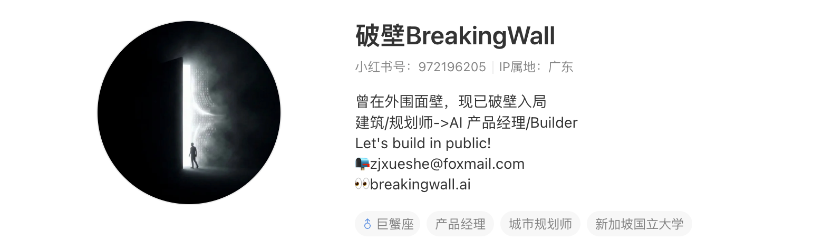

<div align="center">

# 🧱 AIPM Wiki

### AI 产品经理入门知识库

**面试题库 · AI 基础知识 · 应用案例拆解 · 学习路线**

*无论是零基础转行还是持续进步,一个仓库就够了。*

[](LICENSE)
[](CONTRIBUTING.md)
[](../../stargazers)


---

<a href="https://www.xiaohongshu.com/user/profile/5c737935000000001102ce47">

</a>

本仓库由 [**破壁BreakingWall**](https://www.xiaohongshu.com/user/profile/5c737935000000001102ce47) 创建并维护

*曾在外围面壁,现已破壁入局 · 建筑/规划师 → AI 产品经理/Builder · Let's build in public!*

📕 [小红书 @破壁BreakingWall](https://www.xiaohongshu.com/user/profile/5c737935000000001102ce47) · 👀 [breakingwall.ai](https://breakingwall.ai) · 📮 zjxueshe@foxmail.com

</div>

---

## 🎯 这个仓库能帮你做什么

> 让一个没有 AI 背景的产品经理(或想转行的同学),沿着目录从头读到尾,就能建立起 AI 产品经理的完整知识框架,并能应对主流公司的 AI 产品经理面试。

- 🚀 **准备面试?** 直接进入 [04-interview 面试题库](docs/04-interview/README.md) —— 概念题、设计题、案例题、行为面 + 12 篇真实面经
- 🌱 **零基础入门?** 从 [00-roadmap 学习路线](docs/00-roadmap/README.md) 开始,按目录编号顺序阅读
- 🔍 **查概念?** 打开 [AI 术语速查表](docs/01-ai-basics/glossary.md)
- 💰 **算成本 / 做选型?** 见 [成本测算入门](docs/02-pm-skills/cost-and-tech/llm-cost-101.md) 与 [2026 模型盘点](docs/01-ai-basics/llm/model-landscape.md)(数据核实至 2026-07)

## 🧑‍💻 推荐使用方式:Obsidian + Claudian

本仓库是一个 [Obsidian](https://obsidian.md) vault,用 Markdown + 双向链接组织内容。直接在 GitHub 网页上阅读完全没问题,但如果想要最佳体验——AI 问答检索、双向链接跳转、知识图谱可视化——推荐这样打开:

1. 安装 [Obsidian](https://obsidian.md)(免费)
2. `git clone` 本仓库,或直接下载 zip 解压到本地
3. Obsidian → **Open folder as vault** → 选择本仓库根目录
4. 设置 → **Community plugins** → 关闭 Restricted mode → **Browse** → 搜索 **Claudian**(作者 YishenTu,注意社区里有几个近名插件)→ Install → Enable
5. 现在可以直接在侧边栏用 AI 问答整个知识库、点击 `[[双向链接]]` 在文章间跳转、打开 Graph view 看知识网络全貌

> 💡 [Claudian](https://github.com/YishenTu/claudian) 是 Obsidian 官方社区插件市场里的一个插件,能让你在 vault 内直接和 Claude 对话、检索笔记。本仓库的大部分内容正是用 Obsidian + Claudian 协作撰写和维护的——这也是我们把它称为"最佳使用方式"的原因。

## 🌐 或者:飞书只读版(网页直接看)

不想 clone、也不想装 Obsidian?可以直接在浏览器里看飞书版:

👉 [AI 产品经理知识库(飞书)](https://my.feishu.cn/wiki/JKW1wA6uRig0qIkqIeScXLEon1b)

> ⚠️ 飞书版由 GitHub 单向同步生成,**只读展示**,内容可能有延迟;真正的最新版本、讨论和贡献入口始终在本仓库。发现问题请在 GitHub 提 Issue,不要在飞书上编辑。

## 📖 内容导航

| 板块 | 内容 | 适合谁 |
|------|------|--------|
| 🗺️ [00 学习路线](docs/00-roadmap/README.md) | 转行指南、能力模型、岗位盘点、入门路径 | 所有新人的第一站 |
| 🧠 [01 AI 基础知识](docs/01-ai-basics/README.md) | 机器学习、大模型、Prompt 工程、术语表 | 补齐技术认知 |
| 🛠️ [02 AI PM 核心技能](docs/02-pm-skills/README.md) | PRD 写法、模型评估、数据标注、成本测算 | 上手实际工作 |
| 🔬 [03 应用案例拆解](docs/03-case-studies/README.md) | ChatGPT、Perplexity、Sora、智能客服等实案 | 建立产品 sense |
| 🎯 [04 面试题库](docs/04-interview/README.md) | 概念题、产品设计题、案例题、行为面、面经 | 求职冲刺 |
| 📚 [05 资源导航](docs/05-resources/README.md) | 书籍、课程、Newsletter、工具、必读文章 | 持续学习 |

## 🗺️ 建议学习路径

```
00 学习路线(1 天,了解全貌)
   ↓
01 AI 基础知识(2-3 周,建立技术认知)
   ↓
02 AI PM 核心技能(2-3 周,理解工作内容)
   ↓
03 应用案例拆解(持续,培养产品 sense)
   ↓
04 面试题库(求职前 2-4 周集中刷)
```

## ✨ 内容特色

- **一手信源**:技术与行情类文章的模型、价格、政策均核实自 Anthropic / OpenAI / Google 官方文档与博客,并标注访问时间
- **PM 视角**:不堆公式,只讲"能做什么、边界在哪、成本如何、产品上怎么用"
- **统一格式**:面试题遵循「题目 → 考察点 → 参考答案 → 追问延伸 → 相关阅读」,案例遵循统一拆解模板
- **知识成网**:正课、面试题、案例之间充分交叉引用,顺着链接读就是一张知识网

## 🤝 参与贡献

本仓库靠社区共建,欢迎:

- 🐛 发现内容错误 → 提 [Issue](../../issues/new/choose) 或直接 PR
- ✍️ 投稿面试题 / 面经 / 案例拆解 → 使用 [templates/](templates/) 中的模板,提 PR
- 💬 讨论与提问 → [Discussions](../../discussions)

详见 [贡献指南](CONTRIBUTING.md)。

## ⭐ 支持一下

如果这个仓库帮到了你:

1. 点个 **Star** ⭐,让更多转行路上的同学看到它
2. 关注 [小红书 @破壁BreakingWall](https://www.xiaohongshu.com/user/profile/5c737935000000001102ce47),看知识库背后的 build in public 过程
3. 把它转发给正在准备 AI PM 面试的朋友

## 📄 版权说明

本仓库内容采用 [CC BY-NC-SA 4.0](LICENSE) 协议:允许署名转载与二次创作,禁止商用。

---

<div align="center">

*Built in public by [破壁BreakingWall](https://www.xiaohongshu.com/user/profile/5c737935000000001102ce47) 🧱*

</div>
